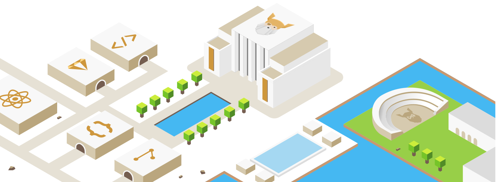

# The Odin Project — My Learning Journey

Welcome to my personal archive documenting my path through [The Odin Project](https://www.theodinproject.com/). 

Here you'll find all the projects and exercises I've built while mastering web development, from foundational HTML/CSS to interactive JavaScript applications.

## 📂 Foundations Course
> *Building a solid foundation in web development, Git workflows, and DOM manipulation.*

### 🛠️ Projects

| Project | Topic(s) | Repository | Preview |
| :--- | :--- | :---: | :---: |
| **Recipes** | HTML and CSS Foundations, Git Basics | [`Code`](./foundations/recipes) | [🌐 Live Demo](https://cedarku.github.io/the-odin-project/foundations/recipes/) |
| **Landing Page** | CSS Cascade, Flexbox | [`Code`](./foundations/landing-page) | [🌐 Live Demo](https://cedarku.github.io/the-odin-project/foundations/landing-page/) |
| **Rock, Paper, Scissors** | JS Basics: Functions & Conditionals | [`Code`](./foundations/rock-paper-scissors) | [🌐 Live Demo](https://cedarku.github.io/the-odin-project/foundations/rock-paper-scissors/) |
| **Etch-a-Sketch** | JS Basics: DOM Manipulation & Events | [`Code`](./foundations/etch-a-sketch) | [🌐 Live Demo](https://cedarku.github.io/the-odin-project/foundations/etch-a-sketch/) |
| **Calculator** | JS Basics: UI & Logical Operations | [`Code`](./foundations/calculator) | [🌐 Live Demo](https://cedarku.github.io/the-odin-project/foundations/calculator/) |

### 📝 Exercises

| Exercise Set | Code |
| :--- | :---: |
| **CSS Exercises** | [`Code`](./foundations/exercises/css-exercises) |
| **JavaScript Exercises** | [`Code`](./foundations/exercises/javascript-exercises) |

