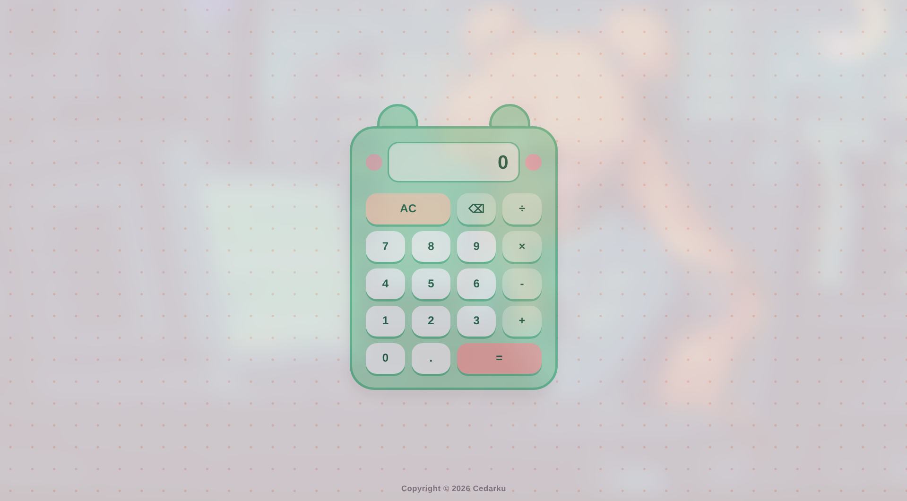

# 🐸 Kawaii Calculator

Welcome to the **Kawaii Calculator** project! This interactive web application was built as part of the **[The Odin Project](https://www.theodinproject.com/)** curriculum.

The main objective of this project is to build a functional calculator from scratch using **HTML, CSS, and JavaScript**, demonstrating key concepts such as DOM manipulation, event handling, state management, and mathematical logic.

## 🚀 Live Demo

<table align="center">
    <tr>
        <td align="center">
         
        👉 <a href="https://cedarku.github.io/calculator/"><strong>View Live Demo</strong></a>
        </td>
    </tr>
</table>

## ✨ Features

* **Core Math Operations:** Addition, subtraction, multiplication, and division.
* **Kawaii Theme:** Custom frog-inspired design with a soft pastel color scheme.
* **Smart Error Handling:**
  * Prevents division by zero with safe error feedback.
  * Decimal control (prevents entering multiple decimals in a single number).
* **Additional Controls:**
  * Clear button to reset current calculations.
  * Backspace support for step-by-step deletion.
  * Keyboard support for quick input.

## 🛠️ Built With

* **HTML5:** Semantic structure and dataset attributes for clean event targeting.
* **CSS3:** Custom styles, pastel palette, flexbox/grid layout, and interactive button states.
* **JavaScript (Vanilla JS):** Calculator logic, state tracking, and DOM manipulation.

## Acknowledgments

* Project prompt and instructions provided by **[The Odin Project](https://www.theodinproject.com/)**.
* Design and development by Cedarku.