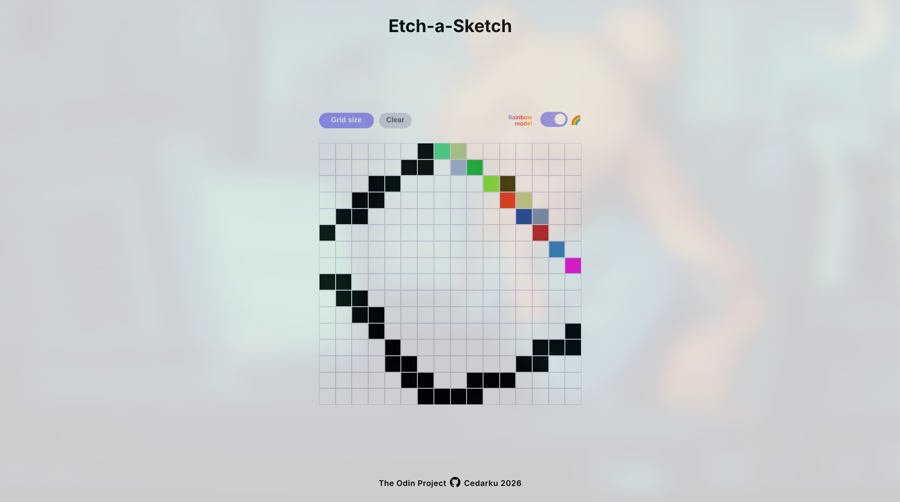

# TOP Project: Etch-a-Sketch

A browser-based drawing application built with HTML, CSS, and JavaScript as part of **The Odin Project** Foundations curriculum.

Users can sketch by hovering over the grid, generate a new grid with a custom size (up to **100×100**), and continue drawing without reloading the page.

## Live Demo

<table align="center">
    <tr>
        <td align="center">
         
        👉 <a href="https://cedarku.github.io/the-odin-project/foundations/etch-a-sketch/"><strong>Play Etch-a-Sketch</strong></a>
        </td>
    </tr>
</table>

## Features

* 🎨 Draw by hovering over the grid
* 📏 Generate grids from **1×1** up to **100×100**
* 🔄 Dynamic grid regeneration without refreshing the page
* ✅ Input validation with graceful handling of invalid values and prompt cancellation
* 📱 Responsive square sizing that always fits the drawing area
* 🌈 Rainbow Mode switch

## Built With

* HTML5
* CSS3 (Flexbox)
* JavaScript (DOM Manipulation)

## What I Learned

This project gave me hands-on experience with:

* Creating and removing DOM elements dynamically
* Manipulating the DOM using JavaScript
* Working with event listeners
* Building reusable functions
* Validating user input
* Generating dynamic layouts based on user input

## Acknowledgements

This project is part of **The Odin Project** Foundations curriculum.
