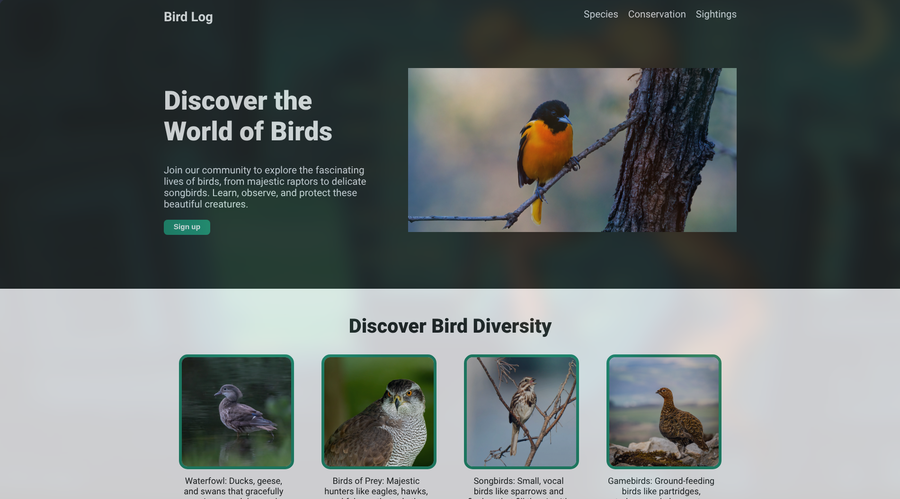

# 🐦 Bird Log Landing Page

Welcome to the **Bird Log Landing Page** project! This interactive web application was built as part of the **[The Odin Project](https://www.theodinproject.com/)** curriculum.

The main objective of this project is to build a structured landing page layout from scratch using **HTML and CSS**, demonstrating key concepts such as semantic HTML, CSS flexbox, responsive design, and page styling.

## 🚀 Live Demo

<table align="center">
    <tr>
        <td align="center">
         
        👉 <a href="https://cedarku.github.io/the-odin-project/foundations/landing-page/"><strong>View Live Demo</strong></a>
        </td>
    </tr>
</table>

## ✨ Features

* **Bird Theme:** Custom nature-inspired design focusing on different bird species.
* **Responsive Layout:** Clean page structure built entirely with CSS Flexbox.
* **Information Sections:**
  * Categorized bird sections (Waterfowl, Birds of Prey, Songbirds, Gamebirds).
  * Inspiring quote by Henry Van Dyke.
* **Call to Action:** Dedicated section prompting users to sign up and keep a personalized log of their bird sightings.

## 🛠️ Built With

* **HTML5:** Semantic structure for clean layout and maintainability.
* **CSS3:** Custom styles, Flexbox layout, and image positioning.

## Acknowledgments

* Project prompt and instructions provided by **[The Odin Project](https://www.theodinproject.com/)**.
* Design and development by Cedarku.
* Photography provided by:
  * Aaron J Hill - [Pexels](https://www.pexels.com/es-es/foto/pajaro-animal-rama-aviar-12755521/)
  * Tim Heckmann - [Pexels](https://www.pexels.com/es-es/foto/naturaleza-pajaro-agua-pato-17910766/)
  * chris clark - [Pexels](https://www.pexels.com/es-es/foto/pajaro-pico-fauna-vida-salvaje-23963812/)
  * A. G. Rosales - [Pexels](https://www.pexels.com/es-es/foto/37978520/)
  * Rafal Cho - [Pexels](https://www.pexels.com/es-es/foto/pajaro-retrato-fauna-vida-salvaje-11756642/)