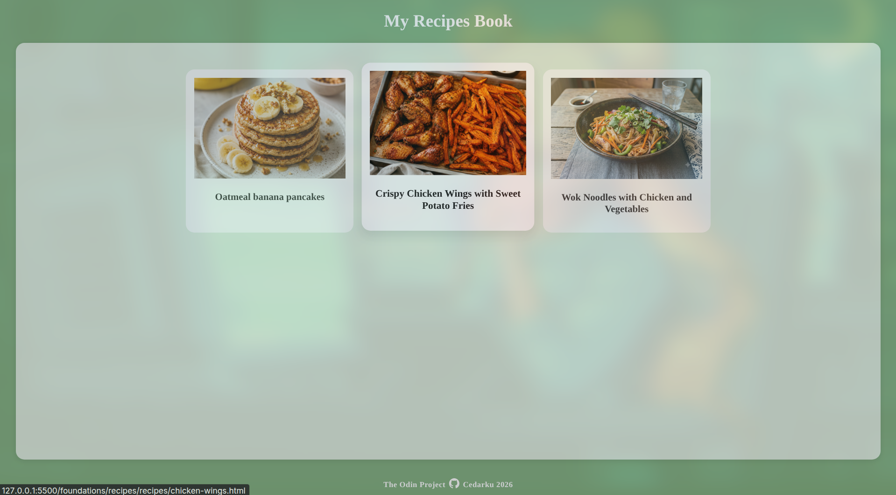
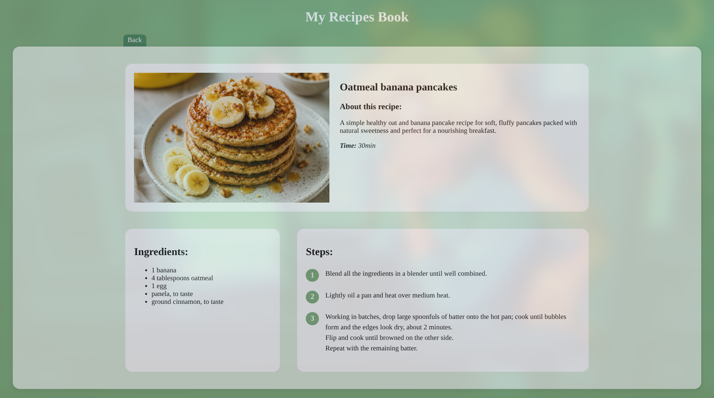

# 📖 Odin Recipes

Welcome to the **Odin Recipes** project! This interactive web application was built as part of the **[The Odin Project](https://www.theodinproject.com/)** curriculum.

The main objective of this project is to build a functional multi-page recipe website using **HTML and CSS**, demonstrating key concepts such as semantic HTML structure, responsive flexbox layout, and CSS styling.

## 🚀 Live Demo

<table align="center">
    <tr>
        <td align="center">
            
        </td>
        <td align="center">
            
        </td>
    </tr>
    <tr>
        <td align="center" colspan="2">
             👉 <a href="https://cedarku.github.io/the-odin-project/foundations/recipes/"><strong>View Live Demo</strong></a>
        </td>
    </tr>
</table>

## ✨ Features

* **Multi-page Architecture:** A main directory with links to individual, detailed recipe pages.
* **Premium Styling:** Custom CSS with a cohesive color scheme and interactive hover effects on recipe cards.
* **Smart Layout Design:**
  * Flexbox-based layouts distributing space efficiently.
  * Unique "tab" visual effects seamlessly integrating buttons with content sections.
* **Advanced CSS:** Implementation of CSS counters to generate custom premium circular step numbers.

## 🛠️ Built With

* **HTML5:** Semantic structure, structured lists, and cross-page navigation links.
* **CSS3:** Custom styles, flexbox layout, interactive button states, and pseudo-elements.

## Acknowledgments

* Project prompt and instructions provided by **[The Odin Project](https://www.theodinproject.com/)**.
* Design and development by Cedarku.
