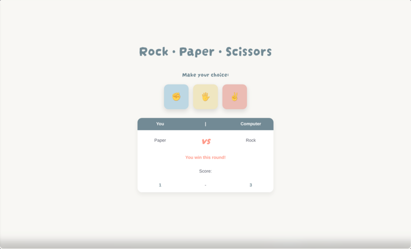
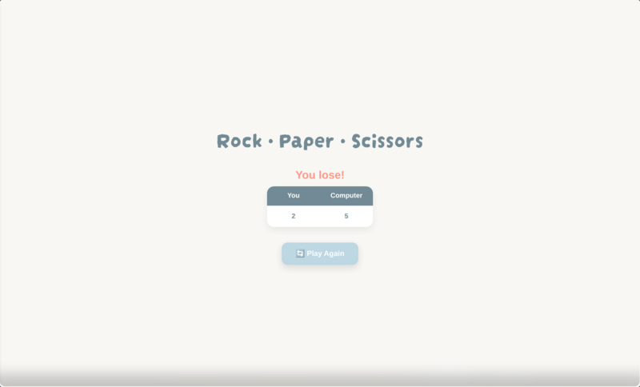

# Rock • Paper • Scissors

A modern browser-based implementation of the classic **Rock Paper Scissors** game built with **HTML**, **CSS**, and **vanilla JavaScript**.

## Preview

<table>
<tr>
<td align="center">
 
Gameplay
</td>

<td align="center">
 
Game Over
</td>
</tr>
</table>

## Live Demo

🔗 https://cedarku.github.io/the-odin-project/foundations/rock-paper-scissors

## Features

- Interactive graphical interface
- Random computer opponent
- Live score tracking
- Final results screen
- Play Again functionality
- Responsive interface

## Built With

- HTML5
- CSS3 (Flexbox)
- JavaScript (DOM Manipulation)

## What I Learned

This project helped me practice:

- DOM manipulation
- Event listeners
- Functions
- Conditional logic
- CSS styling
- Responsive layouts
- Git branching and merging

## Credits

Project from **The Odin Project** Foundations Course.

https://www.theodinproject.com/